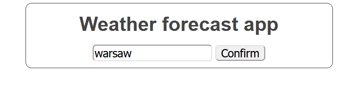
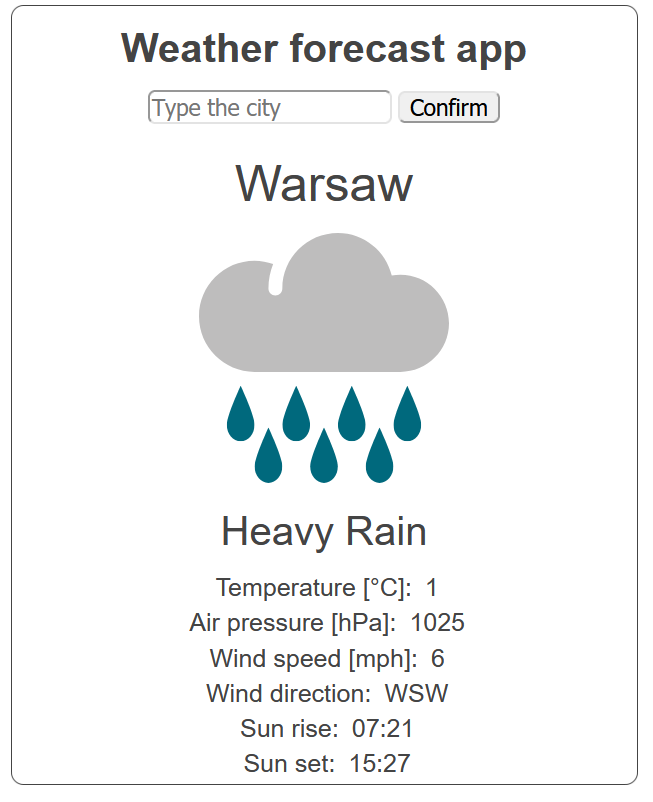
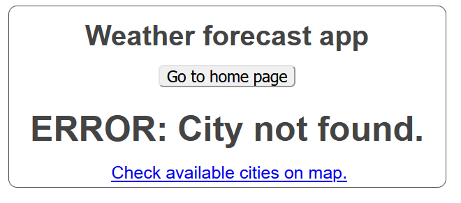

# Weather forecast app
*Spring boot 2 academy*

## General

Weather forecast visualization regarding user request.
 Used the [remote API](https://www.exchangerate-api.com/).

## Technologies

- Java 11
- Maven
- Spring Boot 2.4.0
- Thymeleaf - UI

## Screenshots

