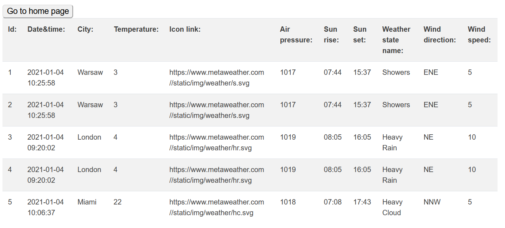

# Weather forecast app
*Spring boot 2 academy*

## General

Weather forecast visualization regarding user request. Application uses the [remote API](https://www.metaweather.com/api/).
Allows following history of weather for selected city. Historical data is saved in DataBase every hour. 
User can display historical data: whole or find by followed city.

## Configuration

application.properties file:

    spring.datasource.url=
    spring.datasource.username=
    spring.datasource.password=
    spring.datasource.driver-class-name=
    
    spring.jpa.hibernate.ddl-auto=update
    spring.jpa.show-sql=<true/false>

## Technologies

- Java 11
- Maven
- Spring Boot 2.4.0
- Thymeleaf - UI
- MySQL - [remotesql](https://remotemysql.com/)
- Hibernate

## Screenshots

