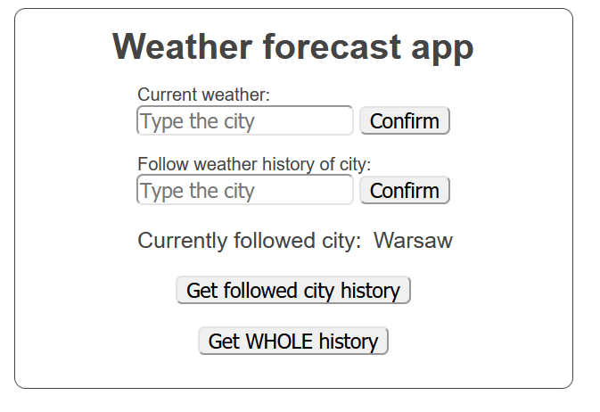
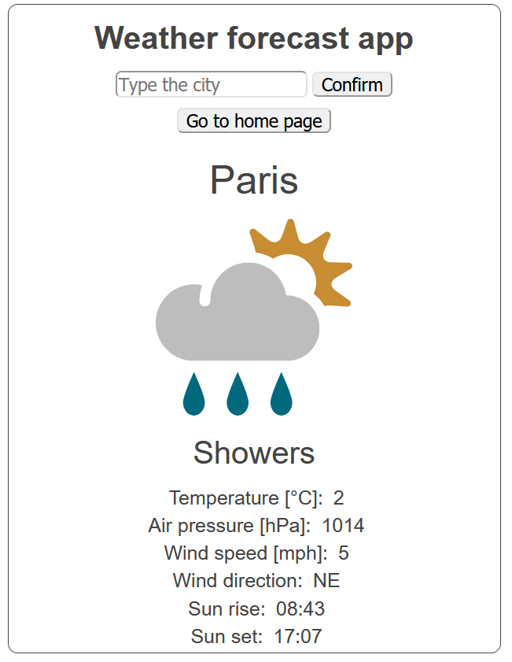

# Weather forecast app
*Spring boot 2 academy*

## General

Weather forecast visualization regarding user request.
 Used the [remote API](https://www.metaweather.com/api/). Application allows following history of weather for selected 
city. Historical data is saved in DB every hour. User can display historical data: whole or find by followed city.

## Technologies

- Java 11
- Maven
- Spring Boot 2.4.0
- Thymeleaf - UI
- MySQL (remotesql.com)
- Hibernate

## Screenshots

